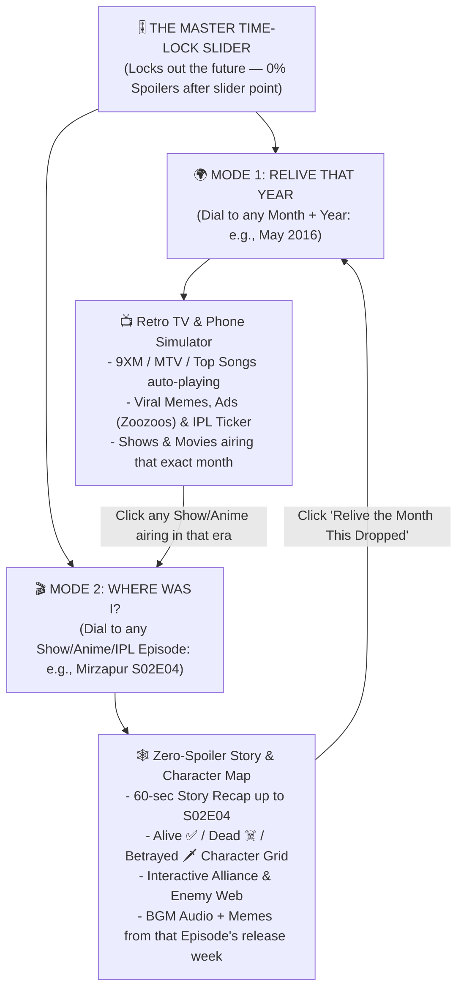

# Master Implementation Plan: `ReliveThatYear × WhereWasI` (The Unified Time-Slider Engine)

> [!IMPORTANT]
> **Why merging these two ideas is a 10x move:**
> * **`WhereWasI` alone** is a utility people only visit once every 6 months when they forget a show's plot.
> * **`ReliveThatYear` alone** is a passive nostalgia toy.
> * **Combined (`Relive × WhereWasI`):** You create an **Interactive Time-Lock Engine** with a single core mechanic—**The Master Time Slider**—where dragging the slider to **any Year/Month** OR **any Show/Episode (`S02E04`)** locks the entire screen to *only what had happened up to that exact moment*, with ambient music, a retro TV/Phone simulator, AND zero-spoiler character/betrayal maps!

---

## 1. The Core Unified Concept: "Freeze Time at Any Moment"

Everything in the app revolves around **One Master Time-Lock Slider** with two seamless modes that cross-link into each other:



---

## 2. How the Two Modes Blend Together

### 🌍 Mode 1: `ReliveThatYear` (The Era Time Machine — 2006 to 2024)
When a user drags the **Year/Month Slider** (e.g., **`April 2020 — Lockdown Era`** or **`May 2016 — Summer Peak`** or **`April 2011 — World Cup Era`**):
1. **Interactive Retro Device on Screen:**
   * **2006–2011:** CRT TV + Nokia N73 / Windows XP Desktop (Orkut, 9XM Bheegi Billi, Vodafone Zoozoos, Cartoon Network Hindi, Deccan Chargers IPL).
   * **2012–2017:** iPhone 5s / Early WhatsApp + Moto G UI (Temple Run, Clash of Clans, Dubsmash, Pokemon Go, *Bahubali 1* "Why did Kattappa kill Bahubali?" era, Virat 2016 IPL).
   * **2018–2022:** Dark-mode Phone + OTT Era (PUBG Mobile, Ludo King, Dalgona Coffee, *Sacred Games* S1, *Mirzapur* S1, *Scam 1992* theme song).
2. **Synced Era Audio Player:**
   * Automatically plays the **#1 Song / BGM** from that exact month (e.g., *Dil Ibaadat*, *Amplifier*, *Tum Hi Ho*, *Scam 1992 Theme*, *Kesariya*).
3. **"What Were You Watching That Month?" Shelf (The Bridge to `WhereWasI`):**
   * Displays the exact TV Shows, Anime, Movies, and Cricket Tournaments that were live during that month.
   * Clicking any show card (e.g., *"Mirzapur Season 2 just dropped in Oct 2020"* or *"Attack on Titan S3 in May 2019"*) immediately slides open **Mode 2 (`WhereWasI`)** locked to that exact point in time!

---

### 🎬 Mode 2: `WhereWasI` (The Zero-Spoiler Story & Character Time-Slider)
When a user searches for a **Web Series, Anime, Movie Universe, or IPL Season** and drags the **Episode Slider** (e.g., **`Mirzapur → Season 2, Episode 4`** or **`Panchayat → Season 2, Episode 8`** or **`MCU → Up to Avengers: Infinity War`**):
1. **Strict Future-Lock (Mathematically 0% Spoilers):**
   * Every event, death, plot twist, and new character from `S02E05` onward is **physically filtered out by the database query** (`WHERE (season < 2) OR (season == 2 AND episode <= 4)`).
2. **Visual Character Status Board (At That Exact Episode):**
   * Shows every character introduced up to `S02E04` with dynamic status badges:
     * `🟢 ALIVE` | `☠️ DEAD (Killed in S01E09)` | `🗡️ BETRAYED` | `❓ MISSING`
   * Clicking a character shows **"What have they done up to S02E04?"** without revealing their future fate.
3. **Interactive Relationship & Betrayal Web (Node Graph):**
   * Lines connecting characters colored by their relationship **at `S02E04`**:
     * `🟢 Allies` (`Guddu ↔ Golu`)
     * `🔴 Blood Enemies` (`Guddu ↔ Munna`)
     * `🟣 Secret Plot / Undercover` (`Sharad ↔ Kaleen Bhaiya`)
   * As you drag the episode slider from `S01E01` → `S02E04`, you literally watch alliances form, break, and characters turn from `🟢 ALIVE` to `☠️ DEAD` in real time!
4. **"Era Context & Soundtrack" Pill (The Bridge Back to `ReliveThatYear`):**
   * Plays the show's iconic BGM while you read the recap, shows spoiler-free memes from up to that episode, and has a 1-click button: **`🕰️ Relive October 2020 (When This Dropped)`** which teleports you into the `ReliveThatYear` desktop/phone simulator for that month!

---

## 3. Database Schema (MongoDB / JSON Hybrid)

### Collection 1: `eras` (`ReliveThatYear` Time Capsules)
```javascript
{
  eraId: "2016-05",                  // YYYY-MM
  title: "Summer 2016 — Peak Internet & IPL Era",
  year: 2016,
  month: 5,
  deviceSkin: "iphone6-ios9",        // Controls the retro UI frame (winxp | nokia | ios9 | lockdown)
  topSongs: [
    { title: "Kar Gayi Chull", artist: "Badshah, Amaal Mallik", youtubeId: "NTHz9ephYTw" },
    { title: "Channa Mereya", artist: "Arijit Singh", youtubeId: "284Ov7ysmfA" },
    { title: "Cheap Thrills", artist: "Sia", youtubeId: "nYh-n7EOtMA" }
  ],
  nostalgiaTVClips: [
    { channel: "9XM", title: "Bheegi Billi & Bakwaas Band Kar", youtubeId: "..." },
    { channel: "Sony MAX", title: "IPL 2016: Virat Kohli 113 vs KXIP", youtubeId: "..." },
    { channel: "Ads", title: "Imperial Blue Men Will Be Men / Zoozoo", youtubeId: "..." }
  ],
  culturalSnapshot: {
    slangOfTheMonth: ["Scenes kya hai", "Pokemon Go", "Dab", "PPAP"],
    maggiPrice: "₹12",
    petrolPrice: "₹65/L",
    topHeadlines: [
      "Reliance Jio announces free 4G preview SIMs with unlimited data",
      "RCB reaches IPL 2016 Final with Virat Kohli scoring 973 runs",
      "Everyone still asking: Why did Kattappa kill Bahubali?"
    ]
  },
  linkedShowsActive: ["game-of-thrones-s6", "naruto-shippuden", "tmkoc-2016"] // Links directly to WhereWasI!
}
```

### Collection 2: `shows` (`WhereWasI` Series & Franchises)
```javascript
{
  slug: "mirzapur",
  title: "Mirzapur",
  category: "Indian Web Series",     // Indian Web Series | Anime | Global TV | Movie Universe
  releaseEraId: "2018-11",           // Links back to ReliveThatYear era!
  bgmAudioUrl: "...",                // Plays theme BGM while reading recap
  seasons: [
    {
      seasonNumber: 1,
      releaseEraId: "2018-11",
      episodes: [
        { ep: 1, title: "Jhandu", airDate: "2018-11-16" },
        // ... up to ep 9
      ]
    },
    {
      seasonNumber: 2,
      releaseEraId: "2020-10",
      episodes: [
        { ep: 1, title: "Dhenkul", airDate: "2020-10-23" }
        // ...
      ]
    }
  ]
}
```

### Collection 3: `episode_snapshots` (The Time-Locked Brain)
```javascript
{
  showSlug: "mirzapur",
  season: 2,
  episode: 4,
  progressIndex: 13,                 // Sequential episode number (e.g. Ep 13 overall)
  storySoFarSummary: "After escaping the brutal wedding massacre in Season 1 where Munna killed Bablu and Sweety, Guddu and Golu have regrouped...",
  bulletRecap: [
    "Bablu Pandit & Sweety are dead after Munna's S1 finale ambush.",
    "Guddu & Golu have taken over the local opium distribution channels.",
    "Sharad Shukla has allied with Kaleen Bhaiya while secretly plotting Mirzapur's takeover."
  ],
  characterStates: [
    { id: "guddu", name: "Guddu Pandit", avatar: "💪", status: "ALIVE", faction: "Pandit Revenge", currentGoal: "Reclaiming Mirzapur from the Tripathis" },
    { id: "bablu", name: "Bablu Pandit", avatar: "👓", status: "DEAD", deathEp: "S01E09", currentGoal: "Killed by Munna at the wedding" },
    { id: "munna", name: "Munna Tripathi", avatar: "👑", status: "ALIVE", faction: "Tripathi Cartel", currentGoal: "Proving himself to Kaleen Bhaiya" },
    { id: "golu", name: "Golu Gupta", avatar: "🔫", status: "ALIVE", faction: "Pandit Revenge", currentGoal: "Avenging Sweety & Bablu" }
  ],
  relationships: [
    { from: "guddu", to: "munna", type: "ENEMY", label: "Sworn Blood Feud" },
    { from: "guddu", to: "golu", type: "ALLY", label: "Co-Leaders" },
    { from: "sharad", to: "kaleen", type: "DOUBLE_AGENT", label: "Fake Loyalty" }
  ],
  eraMemesUpToHere: [
    "Ab humko chahiye full izzat (S01E05)",
    "Chacha, O Bhosdiwale Chacha (S01E01)"
  ]
}
```

---

## 4. Visual UI & Interactive Features (With `ReactBits` Polish)

1. **The Split-Deck Time Machine Switcher (Top Header):**
   * **`[ 🕰️ RELIVE AN ERA (2006–2024) ]`** ↔ **`[ 🎬 CATCH UP ON A SHOW (ZERO SPOILERS) ]`**
2. **The Tactile Time-Scrubber Bar (Hero Component):**
   * A glowing mechanical dial / timeline slider with haptic ticks:
   * In **Relive Mode:** Scrubs across `2007 → 2011 → 2013 → 2016 → 2019 → 2020 → 2024`. As you drag, the entire website's UI theme morphs (from 2008 retro CRT neon to 2016 glossy pop to 2020 cyber dark) and the TV/Phone screen switches channels!
   * In **WhereWasI Mode:** Scrubs across `S01E01 → S01E09 → S02E04 → S03E01`. Any episode to the right of your thumb is **wrapped in chains & fog (`🔒 SPOILER ZONE LOCKED`)**.
3. **Interactive Character Node Graph (Canvas / SVG):**
   * Drag character nodes around; hover over any character to highlight their allies in neon green (`#00ff9d`) and their enemies in blood red (`#ff2442`) at that exact episode.
4. **1-Click Instagram Story / WhatsApp Share Card Generator:**
   * Generates a downloadable card:
     * *"🕰️ Currently living in May 2016 (IPL + 9XM + ₹12 Maggi)"* OR
     * *"🎬 Locked in on Mirzapur at S02E04 (3 Dead, 2 Betrayals, 0 Spoilers)"*

---

## 5. Seed Content to Include on Day 1 (India + Global Hits)

### 🕰️ 6 Iconic Eras for `ReliveThatYear`:
1. **`April 2011`** — India Wins Cricket World Cup, *Dhoni finishes off in style*, Vodafone Zoozoos, 9XM, Orkut/Early FB, ₹10 Maggi.
2. **`May 2013`** — *Aashiqui 2* (*Tum Hi Ho* everywhere), GTA V hype, Yo Yo Honey Singh peak, IPL Spot-Fixing drama, Temple Run.
3. **`May 2016`** — Virat Kohli 973 IPL runs, *Kar Gayi Chull*, Reliance Jio free 4G queues, Pokemon Go, *Bahubali* cliffhanger.
4. **`November 2018`** — *Mirzapur* S1 & *Sacred Games* S1 explode Indian OTT, PUBG Mobile *Pochinki* nights, TikTok India rise.
5. **`April 2020`** — Peak Lockdown: Ramayan on DD National, Ludo King & Among Us at 2 AM, Dalgona Coffee, *Paatal Lok* & *Scam 1992*.
6. **`July 2023`** — *Barbenheimer*, *Farzi* & *Asur 2*, Chandrayaan-3 hype, *Jawan* prevue.

### 🎬 6 Iconic Shows for `WhereWasI` (Each with Multi-Episode Slider Snapshots):
1. ***Mirzapur*** (Seasons 1–3) — Complex deaths, faction switches, and betrayals.
2. ***Panchayat*** (Seasons 1–3) — Phulera village politics, Abhishek, Pradhan Ji, Bhushan (*Banrakas*).
3. ***The Family Man*** (Seasons 1–2) — Srikant Tiwari's spy operations & family secrets.
4. ***Asur*** (Seasons 1–2) — Shubh's mythological clues, Dhananjay Rajpoot, Nikhil Nair.
5. ***Attack on Titan (Anime)*** (Seasons 1–4) — The ultimate test for zero-spoiler character reveals (who is a Titan shifter at S02E06 vs S01E05!).
6. ***Stranger Things*** (Seasons 1–4) — Hawkins crew alliances & Upside Down lore.

---

## 6. Copy-Paste Prompt for Your Other Chat

Paste this exact prompt into your new chat to build the entire merged app in one go:

```text
Build the full-stack web application "REWINDR (ReliveThatYear × WhereWasI)" — the unified Nostalgia Time Machine + Zero-Spoiler Episode & Character Slider Engine.

Use Node.js + Express + MongoDB (auto-connecting to mongodb://127.0.0.1:27017/rewindr with embedded MongoMemoryServer fallback on port 27017) and a rich, interactive dark-mode Frontend with ReactBits effects (SpotlightCard, ClickSpark, 3D TiltedCards, DecryptedText scramble, and an interactive SVG/Canvas Relationship Graph).

Build both interconnected modes around a single Hero Time-Lock Slider:
1. "RELIVE AN ERA" Mode (2008–2024):
   - Interactive Era Scrubber with 6 fully seeded Indian/Global eras (April 2011 World Cup, May 2013 Aashiqui/Honey Singh, May 2016 Jio/Kohli 973, Nov 2018 Mirzapur/PUBG, April 2020 Lockdown/Ludo/Scam1992, July 2023).
   - Retro Virtual TV & Smartphone Simulator on screen playing embedded YouTube music/ads/9XM clips, showing slang, Maggi/Petrol prices, top headlines, and a shelf of "Shows Airing This Month" that click straight into WhereWasI Mode.
2. "WHERE WAS I?" Mode (Zero-Spoiler Show & Anime Catch-Up):
   - Seed 6 full shows (Mirzapur, Panchayat, The Family Man, Asur, Attack on Titan, Stranger Things) with multiple episode slider checkpoints.
   - Dragging the Episode Slider (e.g. S01E01 -> S01E09 -> S02E04 -> S03E02) strictly locks out future spoilers and dynamically updates:
     (a) The "Story So Far" cumulative recap & key quotes
     (b) The Character Status Grid (ALIVE 🟢 / DEAD ☠️ / BETRAYED 🗡️ / MISSING ❓ at that exact episode)
     (c) An interactive visual Relationship & Betrayal Node Graph (Allies in green, Enemies in red, Double Agents in purple)
     (d) A "Relive the Month This Season Dropped" button that teleports back to Mode 1 for that release month!
```
